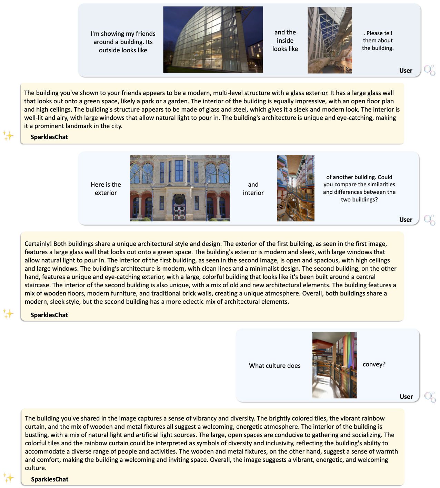

# ✨Sparkles✨
## ✨Sparkles: Unlocking Chats Across Multiple Images for Multimodal Instruction-Following Models

Yupan Huang, Zaiqiao Meng, Fangyu Liu, Yixuan Su, Nigel Collier, Yutong Lu.

[//]: # (<a href='https://hypjudy.github.io/sparkles'></a>)
<a href='https://arxiv.org/pdf/2308.16463.pdf'></a>
<a href='https://github.com/HYPJUDY/Sparkles'>
<a href='https://mail2sysueducn-my.sharepoint.com/:f:/g/personal/huangyp28_mail2_sysu_edu_cn/Et5MO5ScU7pLkK8FQtTykc8BWO220liVyJ0jZENpElXssg?e=k5Ie8L'></a>
<a href='https://www.youtube.com/watch?v=GyBUqfHbp2w'></a> 


Large language models exhibit enhanced zero-shot performance on various tasks when fine-tuned with instruction-following data. 
Multimodal instruction-following models extend these capabilities by integrating both text and images. 
However, existing models such as MiniGPT-4 face challenges in maintaining dialogue coherence in scenarios involving multiple images. 
A primary reason is the lack of a specialized dataset for this critical application. 
To bridge these gaps, we present **SparklesChat**, a multimodal instruction-following model for open-ended dialogues across multiple images. 
To support the training, we introduce **SparklesDialogue**, the first machine-generated dialogue dataset tailored for word-level interleaved multi-image and text interactions. 
Furthermore, we construct **SparklesEval**, a GPT-assisted benchmark for quantitatively assessing a model's conversational competence across multiple images and dialogue turns. 
Our experiments validate the effectiveness of SparklesChat in understanding and reasoning across multiple images and dialogue turns. 
Specifically, SparklesChat outperformed MiniGPT-4 on established vision-and-language benchmarks, including the BISON binary image selection task and the NLVR2 visual reasoning task. 
Moreover, SparklesChat scored 8.56 out of 10 on SparklesEval, substantially exceeding MiniGPT-4's score of 3.91 and nearing GPT-4's score of 9.26. 
Qualitative evaluations further demonstrate SparklesChat's generality in handling real-world applications.

### Click the image below to watch the demo video:
[](https://www.youtube.com/watch?v=GyBUqfHbp2w)


<details>
<Summary>Key snapshots of three demos.</Summary>


</details>

### SparklesChat


### SparklesDialogue


### SparklesEval


## Setup
### Installation
```bash
git clone https://github.com/HYPJUDY/Sparkles.git
cd Sparkles
conda env create -f environment.yml
conda activate sparkles
```

### Setup OpenAI API
Required for generating SparklesDialogue and evaluation on SparklesEval.
See [OpenAI API](https://platform.openai.com/docs/api-reference/introduction) and [call_gpt_api.py](dataset/call_gpt_api.py) for more details.
```bash
export OPENAI_API_KEY="your-api-key-here"  # required, get key from https://platform.openai.com/account/api-keys
export OPENAI_ORGANIZATION="your-organization-here"  # optional, only if you want to specify an organization
export OPENAI_API_BASE="https://your-endpoint.openai.com"  # optional, only if calling the API from Azure
```

### Download Resources
Most related resources for Sparkles are available on [OneDrive](https://mail2sysueducn-my.sharepoint.com/:f:/g/personal/huangyp28_mail2_sysu_edu_cn/Et5MO5ScU7pLkK8FQtTykc8BWO220liVyJ0jZENpElXssg?e=k5Ie8L).
<details>
  <summary>Structure of Resources.</summary>

```bash
Sparkles
├── models
│   ├── pretrained
│   │   ├── sparkleschat_7b.pth
│   │   ├── minigpt4_7b_stage1.pth
├── data
│   ├── SparklesDialogueCC
│   │   ├── annotations
|   |   |   ├── SparklesDialogueCC.json
|   |   |   ├── SparklesDialogueCC.html
|   |   |   ├── SparklesDialogueCC_50demo_img11.json
|   |   |   ├── ...
|   |   |   ├── SparklesDialogueCC_turn1_1img.json
|   |   |   ├── ...
│   │   ├── images
│   ├── SparklesDialogueVG
│   │   ├── annotations
|   |   |   ├── SparklesDialogueVG.json
|   |   |   ├── SparklesDialogueVG.html
|   |   |   ├── SparklesDialogueVG_turn1_2img.json
|   |   |   ├── ...
│   │   ├── images
│   ├── cc_sbu_align
│   │   ├── image
│   │   ├── filter_cap.json
│   │   ├── ...
│   ├── SVIT
│   │   ├── detail_description.json
│   │   ├── SVIT_detail_description_filtered_for_Sparkles.json
│   ├── LLaVA
│   │   ├── complex_reasoning_77k.json
│   │   ├── detail_23k.json
│   │   ├── LLaVA_complex_reasoning_77k_filtered_for_Sparkles.json
│   │   ├── LLaVA_detail_23k_filtered_for_Sparkles.json
│   ├── VisualGenome
│   │   ├── image_data.json
├── evaluation
│   ├── SparklesEval
│   │   ├── images
│   │   ├── annotations
|   |   |   ├── sparkles_evaluation_sparkleseval_annotations.json
|   |   |   ├── sparkles_evaluation_sparkleseval_annotations.html
│   │   ├── results
|   |   |   ├── SparklesEval_models_pretrained_sparkleschat_7b.json
|   |   |   ├── SparklesEval_models_pretrained_sparkleschat_7b.html
|   |   |   ├── SparklesEval_models_pretrained_minigpt4_7b.json
|   |   |   ├── SparklesEval_models_pretrained_minigpt4_7b.html
│   ├── BISON
│   │   ├── images
│   │   ├── annotations
|   |   |   ├── sparkles_evaluation_bison_annotations.json
│   │   ├── results
|   |   |   ├── BISON_models_pretrained_sparkleschat_7b_acc0.567.json
|   |   |   ├── BISON_models_pretrained_sparkleschat_7b_acc0.567.html
|   |   |   ├── BISON_models_pretrained_minigpt4_7b_acc0.460.json
|   |   |   ├── BISON_models_pretrained_minigpt4_7b_acc0.460.html
│   ├── NLVR2
│   │   ├── images
│   │   ├── annotations
|   |   |   ├── sparkles_evaluation_nlvr2_annotations.json
│   │   ├── results
|   |   |   ├── NLVR2_models_pretrained_sparkleschat_7b_acc0.580.json
|   |   |   ├── NLVR2_models_pretrained_sparkleschat_7b_acc0.580.html
|   |   |   ├── NLVR2_models_pretrained_minigpt4_7b_acc0.513.json
|   |   |   ├── NLVR2_models_pretrained_minigpt4_7b_acc0.513.html
├── assets
│   ├── images
│   ├── statistics
```

</details>

## Model: SparklesChat

### Download

SparklesChat is trained from the first stage pretrained model of MiniGPT-4, which connects a pretrained vision
encoder and a pretrained LLM with a projection layer. 
For SparklesChat/[MiniGPT-4](https://github.com/Vision-CAIR/MiniGPT-4), only the projection layer is trainable for efficiency and its parameters are saved separately.
The language decoder, [Vicuna](https://github.com/lm-sys/FastChat), is based on the [LLaMA](https://github.com/facebookresearch/llama) framework, which can handle diverse language tasks. 
For image processing, we use the visual encoder from [BLIP-2](https://github.com/salesforce/LAVIS/tree/main/projects/blip2), combining a pretrained [EVA-ViT](https://github.com/baaivision/EVA/tree/master/EVA-CLIP) in Vision Transformer (ViT) backbone with a pretrained Q-Former. 

<details>
  <summary>Detailed instructions to download these pretrained models</summary>
  
1. Pretrained vision models: the weights of [EVA-ViT](https://storage.googleapis.com/sfr-vision-language-research/LAVIS/models/BLIP2/eva_vit_g.pth) and [Q-Former](https://storage.googleapis.com/sfr-vision-language-research/LAVIS/models/BLIP2/blip2_pretrained_flant5xxl.pth) will be downloaded automatically because their links have been embedded in the code.
2. Pretrained language models:
   1. Request access to the LLaMA-7B weight and convert it to the HuggingFace Transformers format to `/path/to/llama-7b-hf/`. See [this instruction](https://huggingface.co/docs/transformers/main/model_doc/llama).
   2. Downlaod the delta weight of the v0 version of Vicuna-7B ([lmsys/vicuna-7b-delta-v0](https://huggingface.co/lmsys/vicuna-7b-delta-v0)) to `/path/to/vicuna-7b-delta-v0/`.
       ```bash
       git lfs install
       git clone https://huggingface.co/lmsys/vicuna-7b-delta-v0
       ```
   3. Add the delta to the original LLaMA weights to obtain the Vicuna weights in `/path/to/vicuna-7b-v0/`. Check [this instruction](https://github.com/lm-sys/FastChat/blob/main/docs/vicuna_weights_version.md#how-to-apply-delta-weights-only-needed-for-weights-v0).
       ```bash
       pip install git+https://github.com/lm-sys/FastChat.git@v0.1.10
       python -m fastchat.model.apply_delta --base /path/to/llama-7b-hf/  --target /path/to/vicuna-7b-v0/  --delta /path/to/vicuna-7b-delta-v0/
       ```
       Then, set the path of `llama_model` in the [configs/models/Sparkles.yaml](sparkles/configs/models/Sparkles.yaml#L16) to the path of the vicuna weight.
       ```yaml
       llama_model: "/path/to/vicuna-7b-v0/"
       ```
3. (Optional, only for training) Download [the first stage pretrained model of MiniGPT-4 (7B)](https://drive.google.com/file/d/1HihQtCEXUyBM1i9DQbaK934wW3TZi-h5/view?usp=share_link) 
   and set the `ckpt` in [train_configs/sparkleschat.yaml](train_configs/sparkleschat.yaml) to the corresponding path.
   ```yaml
   ckpt: '/path/to/Sparkles/models/pretrained/minigpt4_7b_stage1.pth'
   ```
   
4. (Optional, only for inference) Download [the pretrained weight of SparklesChat](#download-resources) and set the `ckpt` to the path in [eval_configs/sparkles_eval.yaml](eval_configs/sparkles_eval.yaml#L10).
   ```yaml
   ckpt: '/path/to/Sparkles/models/pretrained/sparkleschat_7b.pth'
   ```

</details>


### Inference (Demo)
```bash
python demo.py --cfg-path eval_configs/sparkles_eval.yaml  --gpu-id 0 --save-root /path/to/Sparkles/demo/
```

Demo Illustrations.

<details>
  <summary>Create a story and a dialogue that connects places and characters.</summary>


</details>

<details>
  <summary>Compose a song containing two scenes and generate a song title inspired by another image.</summary>


</details>

<details>
  <summary>Describe and reason about different groups of images.</summary>


</details>

### Training
First, please [download the SparklesDialogue dataset](#download-1).
Then, set the `output_dir` in [train_configs/sparkleschat.yaml](train_configs/sparkleschat.yaml) to the path where you want to save the model.
```yaml
output_dir: "/path/to/Sparkles/models/SparklesChat/"
```
Then run
```bash
torchrun --nproc-per-node 8 train.py --cfg-path train_configs/sparkleschat.yaml
```
The default setting is for training the final model of SparklesChat as reported in the paper.

<details>
  <summary>Train other models.</summary>

You can train other models by changing the `sample_ratio` of different datasets or tuning other parameters such as the number of GPUs, batch size, and learning rate.

If you want to train with other datasets such as `LLaVA_description`, `LLaVA_reasoning`, `cc_sbu_align`, please uncomment their relevant configs in `train_configs/sparkleschat.yaml` and download them as well.
Note that for LLaVA, we have adapted the original text annotations (i.e., [`detail_23k.json`](https://huggingface.co/datasets/liuhaotian/LLaVA-Instruct-150K/blob/main/detail_23k.json) and [`complex_reasoning_77k.json`](https://huggingface.co/datasets/liuhaotian/LLaVA-Instruct-150K/blob/main/complex_reasoning_77k.json)) to the format of Sparkles (i.e., `LLaVA_complex_reasoning_77k_filtered_for_Sparkles.json` and `LLaVA_detail_23k_filtered_for_Sparkles.json`). 
You need to download the [COCO images](http://images.cocodataset.org/zips/train2017.zip) to `/path/to/coco/train2017` and specify this path in `train_configs/sparkleschat.yaml`.

</details>


## Data: SparklesDialogue


### Download

Download the [SparklesDialogue dataset](#download-resources) in `/path/to/Sparkles/data/SparklesDialogueVG/` and `/path/to/Sparkles/data/SparklesDialogueCC/`.
Specify the `root_dir` in [train_configs/sparkleschat.yaml](train_configs/sparkleschat.yaml) to the corresponding paths.
Set the `sparkles_root="/path/to/Sparkles/"` in [dataset/config_path.py](dataset/config_path.py).

<details>
  <summary>Example of SparklesDialogueCC.</summary>


</details>

<details>
  <summary>Example of SparklesDialogueVG.</summary>


</details>


### Visualizations
#### Visualize data in HTML
`SparklesDialogueCC.html` and `SparklesDialogueVG.html` have been included in [resources](#download-resources).
Images should be in `/path/to/Sparkles/data/SparklesDialogueCC/images` and `/path/to/Sparkles/data/SparklesDialogueVG/images` respectively.
Otherwise, please specify the `relative_dir` in `dataset/visualize_data_in_html.py` when generating the HTML files:
```bash
python dataset/visualize_data_in_html.py --visualize_SparklesDialogue  # --sparkles_root /path/to/Sparkles/
# you can also visualize the evaluation results
python dataset/visualize_data_in_html.py --visualize_eval_results  # --sparkles_root /path/to/Sparkles/
```


<details>
  <summary>Full page illustration.</summary>

* Click arrows to view detailed image descriptions or the judge model's responses.
* Hover over image IDs to view their corresponding images.
* Click images to view the full-size image.


</details>


#### Statistics and characteristics Visualization
```bash
# Install benepar parser, refer to https://github.com/nikitakit/self-attentive-parser#installation
python -m spacy download en_core_web_md
python dataset/data_statistics.py # --sparkles_root /path/to/Sparkles/
```


<details>
  <summary>SparklesDialogueCC.</summary>

|                                                                                                                                         |                                                                                                                                                |   
|:---------------------------------------------------------------------------------------------------------------------------------------:|:----------------------------------------------------------------------------------------------------------------------------------------------:|
|                 (a) Root verb-noun pairs in user messages.                  |                         (b) Word cloud of assistant messages.                          |
|  (c) Distribution of word lengths in user messages with an average of 26.3 words. |  (d) Distribution of word lengths in assistant  messages with an average of 184.6 words. |
</details>

<details>
  <summary>SparklesDialogueVG.</summary>

|                                                                                                                                         |                                                                                                                                                |   
|:---------------------------------------------------------------------------------------------------------------------------------------:|:----------------------------------------------------------------------------------------------------------------------------------------------:|
|                 (a) Root verb-noun pairs in user messages.                  |                                                                                        |
|  (c) Distribution of word lengths in user messages with an average of 31.5 words. |  (d) Distribution of word lengths in assistant  messages with an average of 210.5 words. |

</details>


### Generation

Prepare detailed image descriptions by downloading the caption sources specified in the table.
Note that image sources are not required for data generation as the images are not sent to GPT-4.

|         Dataset Name          |                                  Image Source                                   |                              Caption Source                               | #Dialogue | #Unique/Total Image |
|:-----------------------------:|:-------------------------------------------------------------------------------:|:-------------------------------------------------------------------------:|:---------:|:-------------------:|
|      SparklesDialogueCC       |    [Conceptual Captions](https://ai.google.com/research/ConceptualCaptions/)    |   [MiniGPT-4](https://huggingface.co/datasets/Vision-CAIR/cc_sbu_align)   |   4,521   |    3,373/12,979     |
|      SparklesDialogueVG       | [Visual Genome](https://homes.cs.washington.edu/~ranjay/visualgenome/api.html)  |             [SVIT](https://huggingface.co/datasets/BAAI/SVIT)             |   2,000   |     7,000/7,000     |
|         SparklesEval          | [Visual Genome](https://homes.cs.washington.edu/~ranjay/visualgenome/api.html)  |             [SVIT](https://huggingface.co/datasets/BAAI/SVIT)             |    150    |       550/550       |


```bash
#The `case_num` should be larger than the final number of the generated data to allow for some failure cases.
python datasets/generate_SparklesDialogue.py --case_num 20 --vg_image_data_path /path/to/Sparkles/data/VisualGenome/image_data.json # --sparkles_root /path/to/Sparkles/
```


## Evaluation: SparklesEval
### Download
Download the [evaluation datasets](#download-resources) including `SparklesEval`, `BISON` and `NLVR2` in `/path/to/Sparkles/evaluation` and set the root directory in `evaluate.sh` and `run.sh`.
```yaml
set_root="--sparkles_root /path/to/Sparkles/"
```
### Run
Set the path of the evaluated model's `ckpt` in [eval_configs/sparkles_eval.yaml](eval_configs/sparkles_eval.yaml#L10).
We have do this for SparklesChat before, change it if you want to evaluate other models.
```yaml
ckpt: '/path/to/Sparkles/models/pretrained/sparkleschat_7b.pth'
```
Evaluate SparklesChat on SparklesEval with one GPU:
```bash
python evaluate.py --sparkles_root /path/to/Sparkles --cfg-path eval_configs/sparkles_eval.yaml --num-beams 1 --inference --gpu-id 0 --dataset SparklesEval --data-from 0 --data-to 150
python evaluate.py --sparkles_root /path/to/Sparkles --cfg-path eval_configs/sparkles_eval.yaml --num-beams 1 --merge-results --dataset SparklesEval
```
Evaluate SparklesChat on SparklesEval, BISON and NLVR2 with multiple GPUs:
```bash
bash ./evaluate.sh
# or
./evaluate.sh 2>&1 | tee "/path/to/Sparkles/evaluation/evaluate.log"
```
or train and evaluate SparklesChat in one script.
```bash
bash ./run.sh
# or
./run.sh 2>&1 | tee "/path/to/Sparkles/evaluation/run.log"
```
### Results
The results in `JSON` and `HTML` formats will be automatically saved under `/path/to/Sparkles/evaluation/{SparklesEval|BISON|NLVR2}/results/`. 

We provide the results of SparklesChat and MiniGPT-4 (7B) in each `results` folder.

All images used in the examples used in the paper are shared in `Sparkles/assets/images`.

[//]: # (Sources of the images are listed in `Sparkles/assets/images/sources.txt`.)

<details>
  <summary>Comparison between SparklesChat and MiniGPT-4 on an example from SparklesEval.</summary>


</details>

<details>
  <summary>Comparison between SparklesChat and MiniGPT-4 on examples of NLVR2 and BISON.</summary>


</details>


## Acknowledgement
If you like our paper or code, please cite us:
```bibtex
@article{huang2023sparkles,
  title={Sparkles: Unlocking Chats Across Multiple Images for Multimodal Instruction-Following Models},
  author={Huang, Yupan and Meng, Zaiqiao and Liu, Fangyu and Su, Yixuan and Nigel, Collier and Lu, Yutong},
  journal={arXiv preprint arXiv:2308.16463},
  year={2023}
}
```

Sparkles is primarily based on [MiniGPT-4](https://github.com/Vision-CAIR/MiniGPT-4), which is built upon [BLIP2](https://github.com/salesforce/LAVIS/tree/main/projects/blip2) from the [LAVIS library](https://github.com/salesforce/LAVIS), and [Vicuna](https://github.com/lm-sys/FastChat), which derives from [LLaMA](https://github.com/facebookresearch/llama/tree/llama_v1). Additionally, our data is generated by OpenAI's [GPT-4](https://openai.com/gpt-4). We extend our sincerest gratitude to these projects for their invaluable contributions.

Our code is distributed under the [BSD 3-Clause License](LICENSE.md). 
Our model is subject to LLaMA's model license. 
Our data is subject to OpenAI's [Terms of Use](https://openai.com/policies/terms-of-use).

Feel free to open issues or email Yupan for queries related to Sparkles. For issues potentially stemming from our dependencies, you may want to refer to the original repositories.


